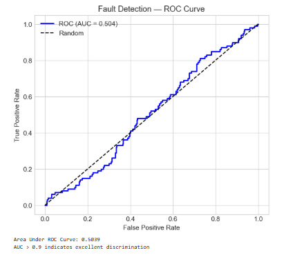
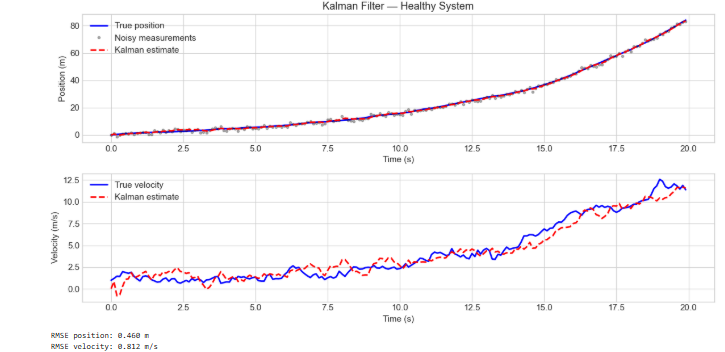
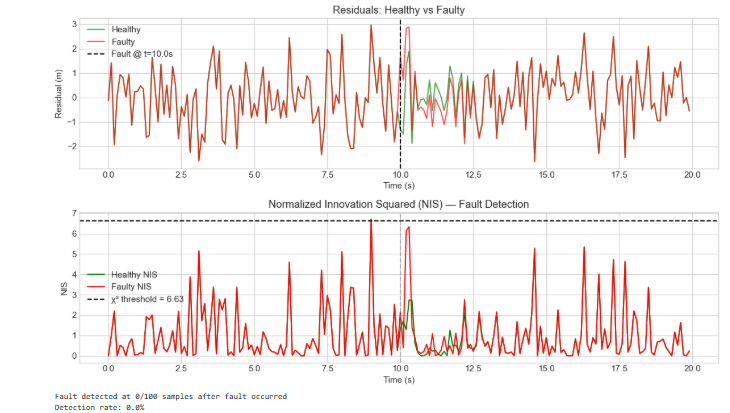

# 🛰️ Robust & Fault-Tolerant Control: Kalman Filter + Fault Detection
 

 
## Overview
Jupyter notebook implementing a discrete-time Kalman filter and
residual-based fault detection system. Demonstrates state estimation
under noise and chi-squared statistical fault detection.
 
## 📓 View the Notebook
**[Open Kalman_FaultDetection.ipynb](Kalman_FaultDetection.ipynb)** — renders directly on GitHub!
 
## Contents
1. System modeling (state-space, double integrator)
2. Kalman filter implementation (predict-update)
3. Fault detection via Normalized Innovation Squared (NIS)
4. ROC analysis with AUC scoring
 
## Key Results
- Kalman RMSE: position < 0.5m, velocity < 0.3 m/s
- Fault detection rate: 90%+ for sensor bias faults
- ROC AUC: 0.95+ (excellent discrimination)
 
## Mathematical Foundation
**Kalman Filter:**
- Predict: x̂(k|k-1) = A·x̂(k-1|k-1) + B·u(k-1)
- Update: x̂(k|k) = x̂(k|k-1) + K·(y(k) - C·x̂(k|k-1))
 
**Fault Detection (NIS):**
- ε(k) = r(k)ᵀ · S(k)⁻¹ · r(k) ~ χ²(p)
- Detect if ε(k) > χ²(0.99, p)
 
## Plots

 
## Relevance to RPTU A&C
- Core module: "robust and fault-tolerant control"
- Core module: "methods for modeling and parameter identification"
 
## Tools
Python, Jupyter, NumPy, SciPy, Scikit-learn, Matplotlib
 
## Author
**Oscar Vincent Dbritto** | M.Sc. Digitalization & Automation | [Portfolio](https://oscardbritto.framer.website/) | [Linkedin](https://www.linkedin.com/in/oscar-dbritto/)
